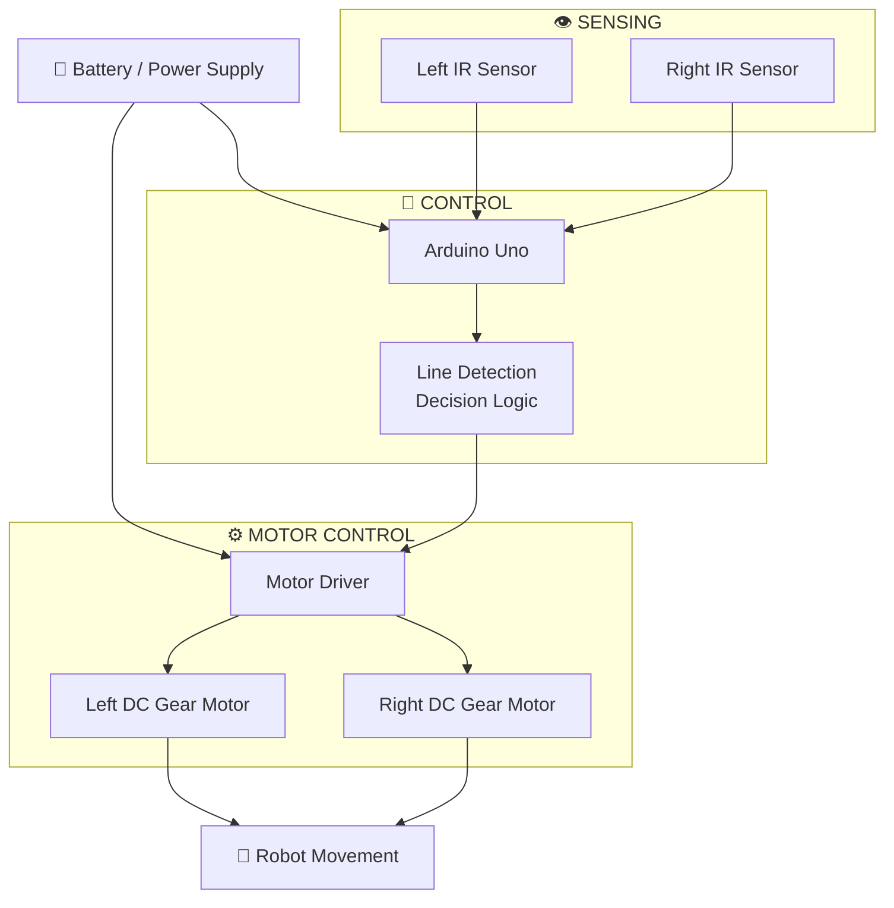
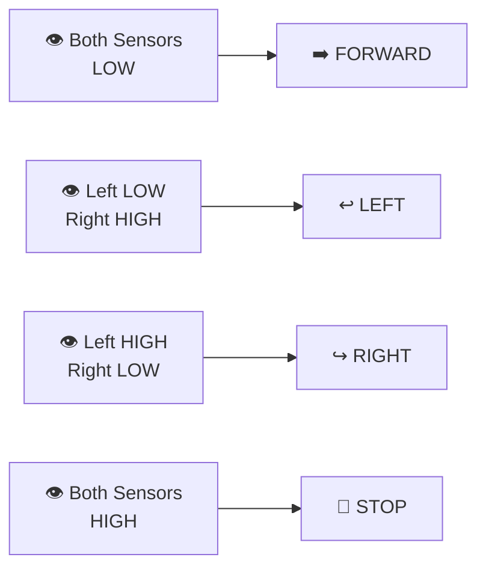
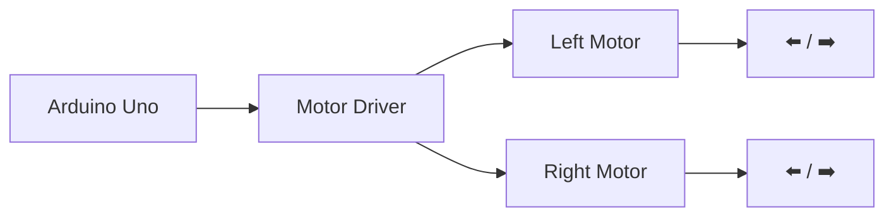
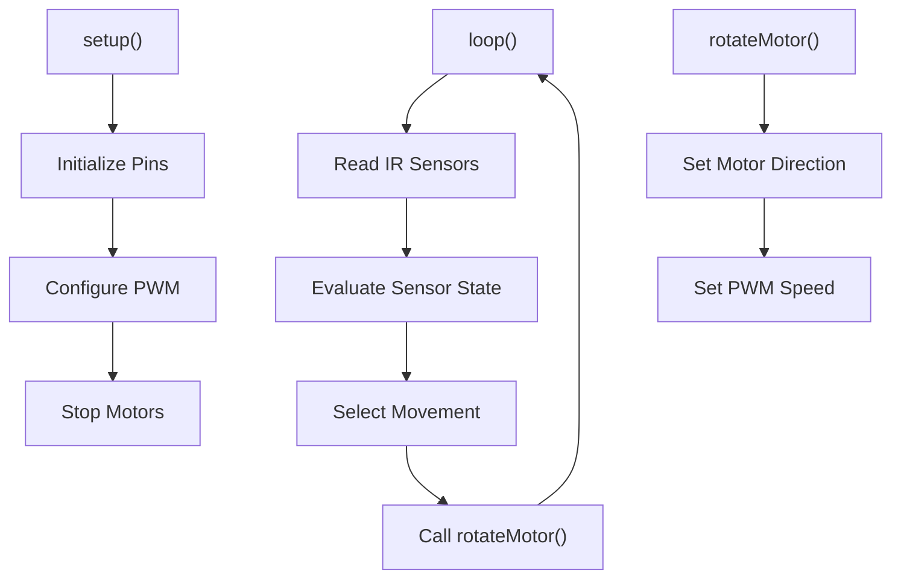
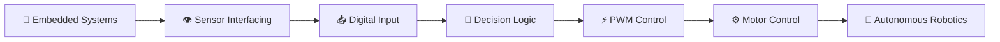
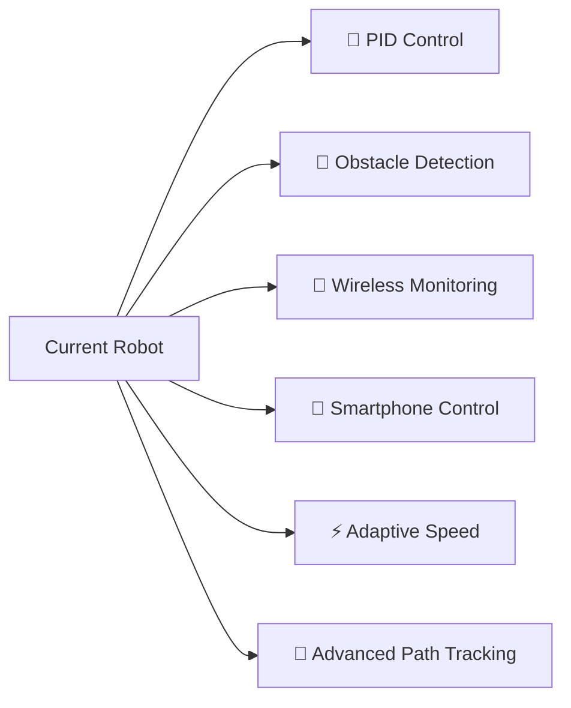

# 🤖 Line Following Robot

<p align="center">
  
</p>

<h3 align="center">
  Sense → Decide → Act → Repeat
</h3>

<p align="center">
  An autonomous line-following robot built using Arduino Uno, dual IR sensors,
  DC gear motors and PWM-based motor control.
</p>

<p align="center">


</p>

---

## 🧭 Project Overview

A line-following robot is a simple example of an autonomous embedded system.

Instead of manually controlling every movement, the robot continuously:

**Detects the line → Processes the sensor states → Decides the direction → Controls the motors**

The robot uses two IR sensors to determine whether it should move forward, turn left, turn right, or stop.

---

# 🧠 How the Robot Thinks

```mermaid
flowchart LR

    A["👁️ IR Sensors"] --> B["🧠 Arduino Uno"]
    B --> C["⚡ Decision Logic"]
    C --> D["🎛️ Motor Driver"]
    D --> E["⚙️ Left Motor"]
    D --> F["⚙️ Right Motor"]

    E --> G["🤖 Robot Movement"]
    F --> G

    G --> A
````

### The basic idea

> **Sensors are the eyes.**
> **Arduino is the brain.**
> **Motors are the muscles.**

This Sense → Decide → Act cycle runs continuously while the robot is powered.

---

# 🔄 Complete Working Flow

```mermaid
flowchart TD

    START(["🚀 START"])

    START --> INIT["Initialize Arduino<br/>Motor Pins + IR Pins"]
    INIT --> PWM["Configure PWM<br/>for Motor Control"]
    PWM --> READ["👁️ Read Left & Right IR Sensors"]

    READ --> CHECK{"🔍 Sensor State?"}

    CHECK -->|"LOW + LOW"| FORWARD["➡️ Move Forward"]
    CHECK -->|"LOW + HIGH"| LEFT["↩️ Turn Left"]
    CHECK -->|"HIGH + LOW"| RIGHT["↪️ Turn Right"]
    CHECK -->|"HIGH + HIGH"| STOP["🛑 Stop"]

    FORWARD --> READ
    LEFT --> READ
    RIGHT --> READ
    STOP --> READ
```

The robot does not make one decision and stop.

It continuously returns to the sensor-reading stage and corrects its movement in real time.

---

# 🎯 Sensor Decision Logic

The program reads two digital IR sensor outputs:

* **Left IR Sensor → D12**
* **Right IR Sensor → D11**

| Left | Right | Robot Action    |
| :--: | :---: | :-------------- |
|  LOW |  LOW  | ➡️ Move Forward |
|  LOW |  HIGH | ↩️ Turn Left    |
| HIGH |  LOW  | ↪️ Turn Right   |
| HIGH |  HIGH | 🛑 Stop         |

> **Note:** The table describes the logic implemented in this program. Whether LOW or HIGH corresponds to a black/white surface depends on the specific IR sensor module and its output configuration.

---

# 🏗️ System Architecture



---

# ⚙️ The Four Possible Decisions



This simple four-state decision system is the core of the robot.

---

# 🔌 Hardware Components

| Component        |   Quantity  | Purpose                         |
| :--------------- | :---------: | :------------------------------ |
| Arduino Uno      |      1      | Main controller                 |
| IR Sensor Module |      2      | Line detection                  |
| DC TT Gear Motor |      2      | Robot movement                  |
| Motor Driver     |      1      | Motor direction & speed control |
| Robot Chassis    |      1      | Mechanical structure            |
| Wheels           |      2      | Movement                        |
| Caster Wheel     |      1      | Support                         |
| Battery          |      1      | Power source                    |
| Jumper Wires     | As required | Electrical connections          |

---

# 📍 Pin Configuration

## 👁️ IR Sensors

| Component       | Arduino Pin |
| :-------------- | ----------: |
| Right IR Sensor |         D11 |
| Left IR Sensor  |         D12 |

## ⚙️ Right Motor

| Function     | Arduino Pin |
| :----------- | ----------: |
| Enable / PWM |          D6 |
| Motor Pin 1  |          D7 |
| Motor Pin 2  |          D8 |

## ⚙️ Left Motor

| Function     | Arduino Pin |
| :----------- | ----------: |
| Enable / PWM |          D5 |
| Motor Pin 1  |          D9 |
| Motor Pin 2  |         D10 |

---

# 🎛️ Motor Control

The robot uses two independently controlled DC motors.



Each motor has:

* Direction control
* PWM speed control
* Forward operation
* Reverse operation
* Stop operation

The main motor speed is defined as:

```cpp
#define MOTOR_SPEED 180
```

---

# ⚡ PWM Control

The motor speed is controlled using PWM.

```cpp
analogWrite(enableRightMotor, abs(rightMotorSpeed));
analogWrite(enableLeftMotor, abs(leftMotorSpeed));
```

The program also modifies the Timer0 PWM frequency used by Arduino pins **D5 and D6**:

```cpp
TCCR0B = TCCR0B & B11111000 | B00000010;
```

This changes the PWM frequency to approximately:

```text
7812.5 Hz
```

The purpose is to obtain more controllable motor behaviour with TT gear motors at the selected operating range.

---

# 🔁 Motor Decision Example

Suppose:

```text
Left Sensor  = LOW
Right Sensor = HIGH
```

The program enters:

```cpp
else if (rightIRSensorValue == HIGH &&
         leftIRSensorValue == LOW)
{
    rotateMotor(-MOTOR_SPEED, MOTOR_SPEED);
}
```

Therefore:

```text
Left Motor   → Forward
Right Motor  → Reverse
       ↓
Robot rotates
       ↓
↩️ Left Turn
```

Similarly:

```text
Left HIGH + Right LOW
        ↓
↪️ Right Turn
```

---

# 💻 Software Logic

The program is divided into three main parts.



### `setup()`

Initializes:

* IR sensor pins
* Motor pins
* PWM configuration
* Initial motor state

### `loop()`

Continuously:

1. Reads both IR sensors
2. Checks their states
3. Selects the required movement
4. Sends motor commands

### `rotateMotor()`

Controls:

* Motor direction
* Motor speed
* Forward movement
* Reverse movement
* Stopping

---

# 🧩 Core Control Algorithm

```text
              ┌───────────────────┐
              │   READ SENSORS    │
              └─────────┬─────────┘
                        │
                        ▼
              ┌───────────────────┐
              │ CHECK LEFT/RIGHT  │
              └─────────┬─────────┘
                        │
          ┌─────────────┼─────────────┐
          │             │             │
          ▼             ▼             ▼
      FORWARD          TURN          STOP
          │             │             │
          └─────────────┼─────────────┘
                        │
                        ▼
                 READ AGAIN 🔄
```

This continuous feedback loop allows the robot to respond to changes in the line.

---

# 📸 Project Gallery

<p align="center">
  
  
</p>

<p align="center">
  
</p>

<p align="center">
  <i>Hardware • Circuit • Working Prototype</i>
</p>

---

# 🎥 Demo

<p align="center">

<!-- Replace the link below with your actual demo video/GIF -->

<a href="Video/line_following_robot.mp4">
  ▶️ <b>Watch the Robot Demo</b>
</a>

</p>

The demonstration shows the robot detecting the path and continuously adjusting its movement using the dual-IR sensing system.

---

# 📂 Repository Structure

```text
Line-Following-Robot/
│
├── 📄 README.md
│
├── 💻 Line_Following_Robot.ino
│
├── 📁 Images/
│   ├── 🖼️ robot.jpg
│   ├── 🖼️ circuit.jpg
│   └── 🖼️ working.jpg
│
└── 📁 Video/
    └── 🎥 line_following_robot.mp4
```

---

# 🧪 Concepts Demonstrated



### Key learning areas

* Embedded C/C++
* Arduino programming
* Digital sensor interfacing
* Motor driver interfacing
* PWM
* Real-time decision making
* Autonomous robotics
* Basic feedback-based control

---

# 🚀 Future Improvements

The current robot uses simple rule-based control.

Possible upgrades include:



### Possible next steps

* 🎯 PID-based line tracking
* ⚡ Adaptive motor speed
* 🚧 Obstacle detection
* 📡 Wireless monitoring
* 📱 Smartphone configuration
* 🧠 Multi-sensor line detection
* 🛣️ Complex path and junction handling

---

# 🌱 What This Project Demonstrates

A simple line-following robot represents a fundamental idea in autonomous systems:

```text
        REAL WORLD
            │
            ▼
       👁️ SENSING
            │
            ▼
       🧠 PROCESSING
            │
            ▼
       ⚡ DECISION
            │
            ▼
       ⚙️ ACTUATION
            │
            ▼
       🤖 MOVEMENT
            │
            └──────────────┐
                           │
                           ▼
                       👁️ SENSE
```

The robot continuously interacts with its environment instead of following a fixed sequence of movements.

---

# 🏁 Project Summary

> **A small robot, but a complete embedded-system feedback loop.**

The project combines **sensor interfacing, embedded programming, decision logic, PWM motor control and autonomous movement** into a single working robotic system.

---

# 👨‍💻 Authors

### Datta Sai Srinivas Devulapalli

**B.Tech – Electronics & Communication Engineering**
**Embedded Systems**

### Goutham Vinjamuri

**B.Tech – Electronics & Communication Engineering**

---

<p align="center">

### 🤖 Built • Tested • Controlled • Learned

</p>

<p align="center">

⭐ <b>If you found this project useful, consider giving the repository a star!</b>

</p>
```
